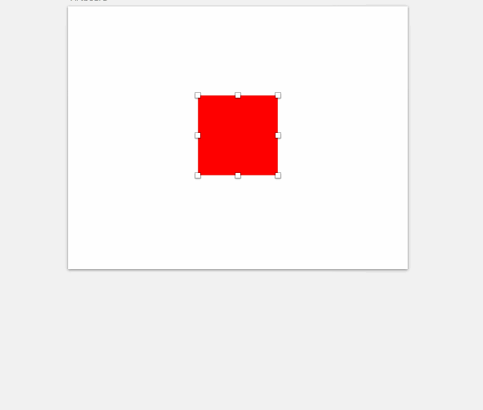

# Resize Commands for Sketch
A Sketch plugin that lets you resize and reposition objects by using simple arithmetic commands, like `b+20,lr+20`. Multiple objects are supported.

## Demo

## How to use
Press <kbd>Cmd</kbd> + <kbd>shift</kbd> + <kbd>q</kbd> to open up a prompt in which you can enter your commands to resize your selection.

## Example usage
* `l+20` // expand selection 20px from left side
* `a-10` // contract 10px from all sides
* `w/2` // divide width by 2
* `x+100` // move selection 100px to the right
* `h=200` // set height to 200px
* `w25%` // make width 25% its size

### Multiple commands
You can easily combine multiple commands by separating them with a , or use multiple directions followed by an operator, like so:
* `lrb+20` // expand selection 20px from left, right & bottom side
* `wh=100` // set width & height to 100px
* `xy+100` // move 100px to the right and down
* `b-20,w=200` // contract 20px from the bottom side, set width to 200px
* `w20%,h/3` // set width to 20%, divide height by 3
* `w*2,tb+50,y-100` // double the width, add 50px to top and bottom, move up by 100px

## Valid directions are:

| Direction     |  |
| :------- | :---- |
| **t** | Top  |
| **b** | Bottom |
| **r** | Right |
| **l** | Left |
| **a** | All directions |
| **w** | Width |
| **h** | Height |
| **x** | X-axis |
| **y** | Y-axis |

| Operator     |  |
| :------- | :---- |
| **+** | Plus  |
| **-** | Minus |
| **\*** | Multiply |
| **=** | Set w or h |
| **/** | Divide |
| **%** | Percentage|

## Installation
 1. [Download](https://github.com/ANGIstudio/Resize-Commands/archive/master.zip) the plugin.
 2. Unzip & run ‘Resize Commands.sketchplugin’ to install

## Thanks to
Matt Stow, who did the heavy lifting for this plugin. His Fireworks plugin [Math Resize](http://mattstow.com/math-resize.html) I have used for a long time!

## Feedback
If you find any issues or have any suggestions, please create an issue. Pull requests are welcome also!

## Created by
[Andre Jilderda](https://github.com/ajilderda) @ [Angi Studio](http://www.angistudio.com), The Hague (NL)
